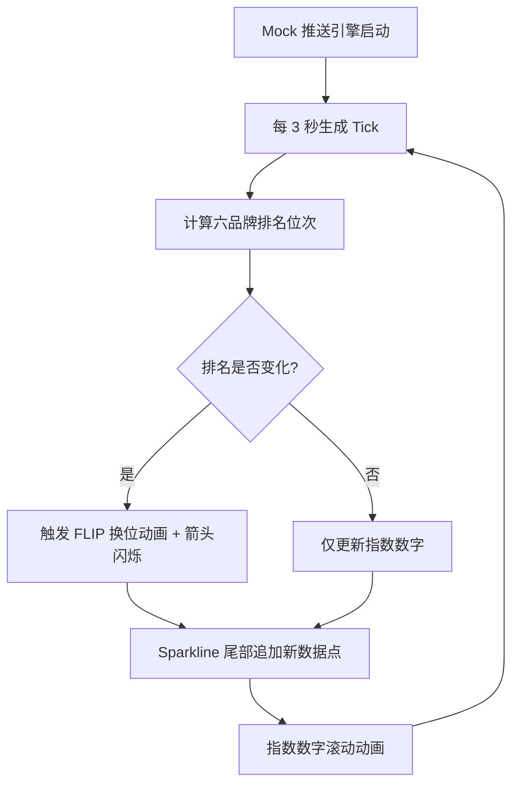

## 1. 产品概述

品牌冲榜实时看板——面向品牌部运营人员，在联名款发售后的关键窗口期内，实时监控六大茶饮品牌（星巴克、瑞幸、Manner、喜茶、奈雪、蜜雪）的热度指数与排名变化，快速识别异常水军冲榜行为。通过每 3 秒服务端推送的 tick 数据，实现零滞后的排名追踪与视觉告警。

## 2. 核心功能

### 2.1 功能模块

1. **冲榜看板页**：六品牌卡片按排名纵向排列、实时 sparkline、排名变化动画

### 2.2 页面详情

| 页面名称 | 模块名称 | 功能描述 |
|----------|----------|----------|
| 冲榜看板页 | 品牌卡片区 | 六列品牌卡片按排名位次纵向排列，显示品牌名、品类、热度指数、排名位次、位次变化箭头 |
| 冲榜看板页 | Sparkline 迷你图 | 每卡片内嵌迷你折线图，展示最近 60 个采样点的热度趋势，新数据尾部追加动画 |
| 冲榜看板页 | 排名变化动画 | 位次变化时卡片平滑换位（FLIP 动画），箭头闪烁（↑↓）提示升降 |
| 冲榜看板页 | 指数滚动动画 | 新 tick 到达时，指数数字以滚动计数器动画过渡到新值 |
| 冲榜看板页 | Mock 推送引擎 | 前端模拟服务端每 3 秒推送 tick（品牌、品类、指数值、排名位次、时间戳） |

## 3. 核心流程

## 4. 用户界面设计

### 4.1 设计风格

- **主色调**：深色赛博朋克风（#0a0e1a 深蓝黑底色），搭配霓虹色系（青色 #00f5d4、品红 #f72585、琥珀 #ffbe0b）作为品牌区分
- **字体**：JetBrains Mono（数据/数字）+ Noto Sans SC（中文品牌名），数字采用 tabular-nums 等宽对齐
- **按钮样式**：无按钮交互，纯看板展示
- **布局风格**：全屏单页看板，六卡片纵向堆叠，左侧排名序号，右侧 sparkline
- **动画**：FLIP 换位、箭头脉冲闪烁、数字滚动、sparkline 描边动画

### 4.2 页面设计概览

| 页面名称 | 模块名称 | UI 元素 |
|----------|----------|---------|
| 冲榜看板页 | 顶栏 | 标题「冲榜监控」、实时时钟、连接状态指示灯 |
| 冲榜看板页 | 品牌卡片 | 排名序号、品牌 Logo 色、品牌名、品类标签、热度指数（大号数字）、位次变化箭头（↑↓）、sparkline 图表 |
| 冲榜看板页 | 底栏 | 最近 tick 时间戳、采样频率标注 |

### 4.3 响应式

- 桌面优先设计，1920×1080 最佳视口
- 卡片宽度自适应，最小 320px
- 移动端卡片全宽堆叠

### 4.4 品牌色彩映射

| 品牌 | 主色 | 品类 |
|------|------|------|
| 星巴克 | #00704A | 咖啡 |
| 瑞幸 | #003399 | 咖啡 |
| Manner | #C8102E | 咖啡 |
| 喜茶 | #E8986C | 新茶饮 |
| 奈雪 | #6AAF6A | 新茶饮 |
| 蜜雪 | #FFD700 | 新茶饮 |
