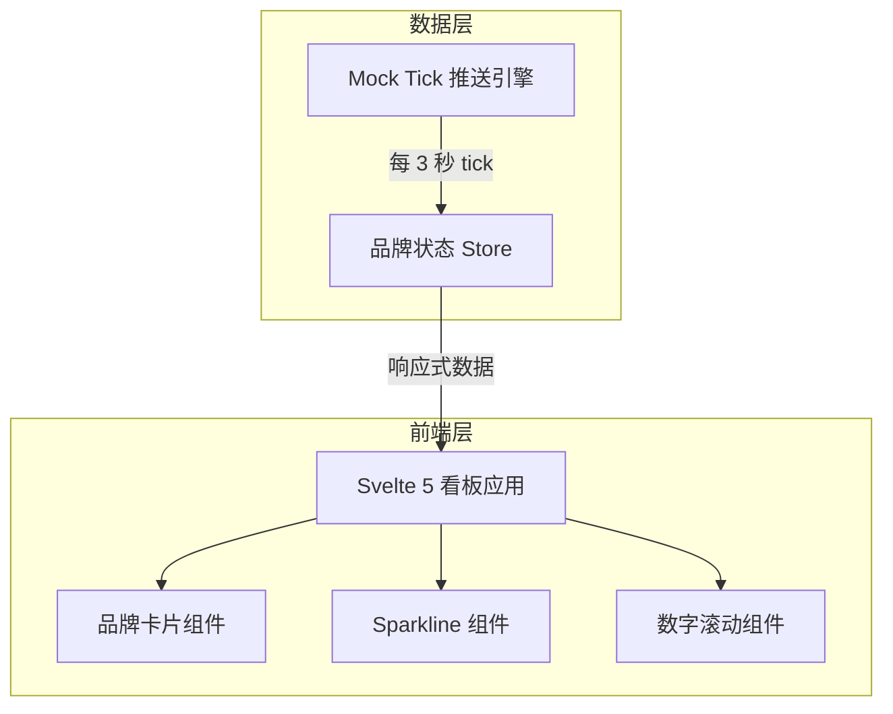

## 1. 架构设计



## 2. 技术说明

- **前端框架**：Svelte 5 + Svelte 5 Runes（$state, $derived, $effect）
- **构建工具**：Vite + @sveltejs/vite-plugin-svelte
- **样式方案**：Tailwind CSS 4
- **动画方案**：Svelte 5 内置 transition + FLIP 动画（animate:flip）+ CSS keyframes
- **图表方案**：Canvas 2D 手绘 sparkline（零依赖，极致性能）
- **状态管理**：Svelte 5 Runes 原生响应式（无需外部状态库）
- **后端**：无（纯前端 Mock 数据）
- **包管理器**：npm

## 3. 路由定义

| 路由 | 用途 |
|------|------|
| / | 冲榜看板主页面（单页应用） |

## 4. 数据模型

### 4.1 Tick 数据结构

```typescript
interface BrandTick {
  brand: string;
  category: string;
  index: number;
  rank: number;
  prevRank: number;
  timestamp: number;
}

interface BrandState {
  brand: string;
  category: string;
  color: string;
  index: number;
  rank: number;
  prevRank: number;
  history: number[];
  lastUpdate: number;
}
```

### 4.2 Mock 推送逻辑

- 初始化六品牌，随机热度指数 500-1000
- 每 3 秒生成新 tick：指数随机波动 ±5~30
- 重新计算排名，记录排名变化
- 历史数据保留最近 60 个采样点
